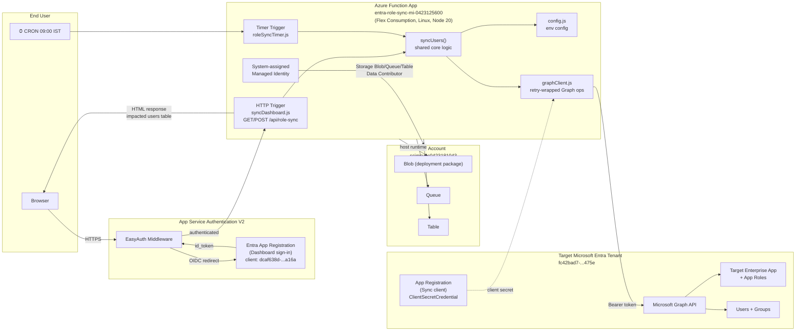
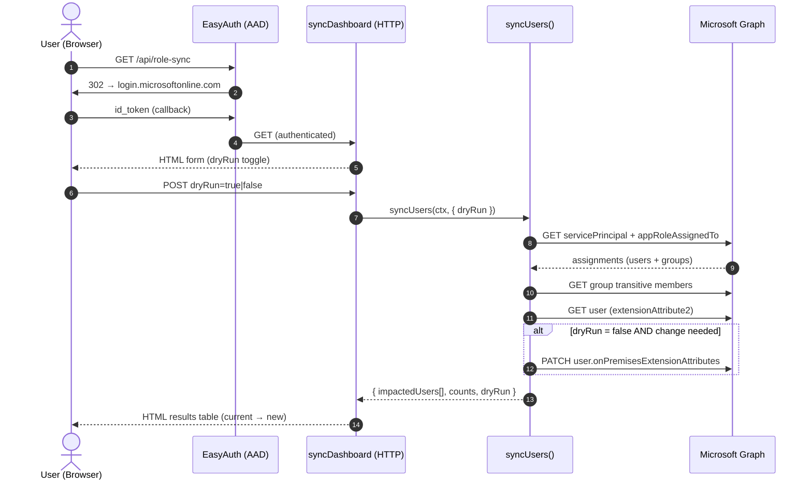
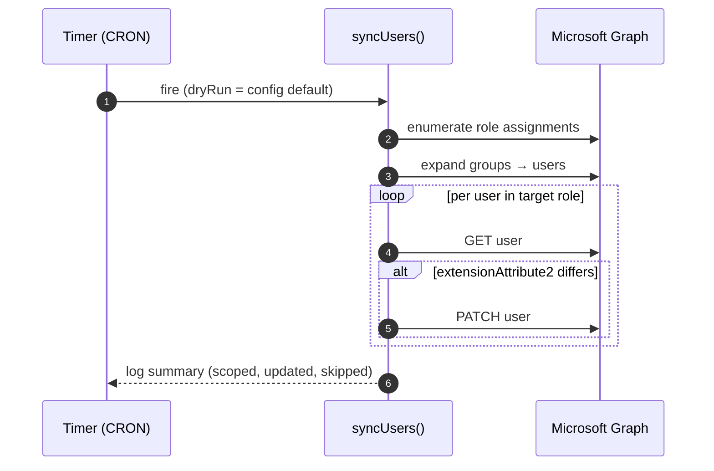

# Entra Role Sync Function — Architecture

## Overview

The application is an Azure Functions app (Node.js, Flex Consumption plan) that
synchronizes Microsoft Entra ID users assigned to a target enterprise application
role by stamping a derived value into their `onPremisesExtensionAttributes.extensionAttribute2`.
It exposes two triggers:

- **Timer trigger** — runs daily at 09:00 IST (`0 30 3 * * *` UTC).
- **HTTP trigger** — browser dashboard at `/api/role-sync` for on-demand runs
  with a dry-run preview, protected by Microsoft Entra ID via App Service
  Authentication V2.

## Component Diagram

## Sync Sequence (HTTP dashboard run)

## Timer Sequence (daily 09:00 IST)

## Key Configuration

| Setting | Purpose |
| --- | --- |
| `GRAPH_TENANT_ID` / `GRAPH_CLIENT_ID` / `GRAPH_CLIENT_SECRET` | Sync client credential into target tenant |
| `TARGET_SERVICE_PRINCIPAL_ID` / `TARGET_APPLICATION_ID` | Enterprise app whose role assignments are scanned |
| `TARGET_APP_ROLE_VALUE` / `TARGET_APP_ROLE_DISPLAY_NAME` | App role to filter users by |
| `TIMER_SCHEDULE` | NCRONTAB schedule (default `0 30 3 * * *`) |
| `DRY_RUN` | Default mode for timer trigger |
| `MAX_GRAPH_RETRIES` | Backoff retry count for 429/503/504 |
| `AzureWebJobsStorage` | Function host storage (managed identity) |

## Required Graph Permissions (Sync client app)

- `Application.Read.All` — read service principal & app role definitions
- `User.Read.All` — read user objects (incl. `onPremisesExtensionAttributes`)
- `User.ReadWrite.All` — patch `extensionAttribute2`
- `GroupMember.Read.All` — expand transitive group memberships

## Dashboard Sign-in App Permissions

- Microsoft Graph delegated: `User.Read`, `openid`, `profile`, `email`
  (admin-consented tenant-wide).
